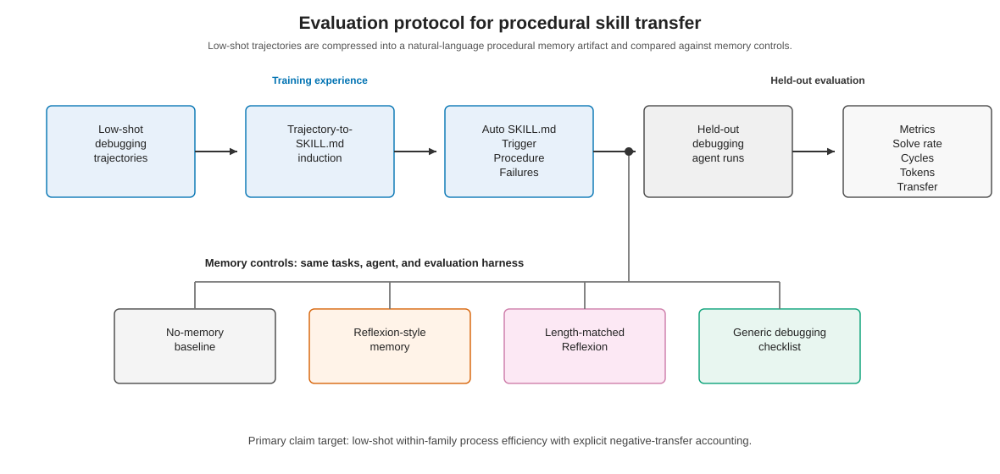

# Method

## Overview

We evaluate whether a language agent can transfer low-shot debugging experience through an induced natural-language procedural memory artifact. The artifact is a `SKILL.md` file, not a patch summary and not a generic prompt. It is induced from a small set of prior debugging trajectories and constrained to express only reusable trigger conditions, debugging procedures, and failure modes. At evaluation time, the same held-out debugging tasks are run with Auto SKILL.md and memory-control baselines under a shared harness.



The design targets three questions. First, does an induced procedural skill improve held-out repair behavior within the same bug family? Second, are improvements visible in process-efficiency metrics such as diagnosis-edit-test cycles and tokens per solved task? Third, does the method expose negative transfer when the induced procedure is misapplied?

## Problem formulation

Let a debugging task be a tuple

```text
t = (r, e, f, c, y)
```

where `r` is a repository checkout, `e` is an executable environment specification, `f` is a failing test signal, `c` is a bug-family label, and `y` is an optional reference patch used only for task verification. The agent observes the repository state, failing test command, failure summary, and method-specific memory artifact. It does not observe the reference patch or held-out solution.

A debugging trajectory is a sequence of diagnosis-edit-test cycles:

```text
tau = [(d_1, I_1, p_1, q_1), ..., (d_m, I_m, p_m, q_m)]
```

where `d_i` is the agent diagnosis, `I_i` is the set of inspected files and reasons, `p_i` is the patch attempt, and `q_i` is the test rerun result. Each trajectory also records final outcome, token usage, tool calls, failed patch count, repeated mistakes, and negative-transfer annotation.

Given `K` training trajectories from the same bug family, the induction procedure produces a skill artifact:

```text
S_K = Induce(tau_1, ..., tau_K)
```

The evaluation compares agents on held-out tasks from the same family with and without `S_K`. The main object of study is not whether the agent can memorize task-specific patches, but whether the induced artifact captures a reusable debugging procedure that improves held-out repair efficiency without increasing negative transfer.

## Task representation

All tasks are serialized with `schemas/task.schema.json`. Each task record contains:

- a stable `task_id`;
- a `bug_family` label for within-family transfer;
- a `split` field (`train`, `heldout`, or `adversarial`);
- repository metadata (`name`, benchmark source, commit, language, and URL when available);
- executable environment metadata (`install_command`, `test_command`, optional `full_test_command`, timeout, and Python version);
- failure metadata (`failing_tests`, `error_type`, optional error message, and failure-log path);
- optional ground-truth metadata used for verification only;
- labels describing surface pattern and root-cause type.

The current hard-smoke study uses PyBugHive tasks from the `black` formatter project [@antal2024pybughive]. We selected a harder held-out slice after an earlier MVP was too easy for generic baselines. Candidate tasks were ranked by patch and test complexity, number of changed source/test files, broader full-test availability, and issue patterns suggesting nontrivial formatter behavior. Eight pilot-light candidates were materialized; seven reproduced their initial failure and passed after the reference patch. `pybughive_black_1632` was excluded because the reference patch failed verification.

The primary same-model analysis uses the first six verified hard tasks:

```text
pybughive_black_132
pybughive_black_133
pybughive_black_154
pybughive_black_183
pybughive_black_193
pybughive_black_232
```

The seventh verified task, `pybughive_black_234`, is reported as exploratory because it was run later with a different model after the original model configuration became unavailable.

## Trajectory collection

All agent runs are serialized with `schemas/trajectory.schema.json`. A trajectory includes the run ID, task ID, method, model, budget, final outcome, and cycle records. The final outcome records whether the task was solved, whether the narrow and full test commands passed, whether existing tests were broken, cycle count, LLM turns, tool calls, token usage, prompt-overhead tokens, active-debugging tokens, and failed patch count.

Cycle records follow the diagnosis-edit-test structure. Each cycle stores:

- the cycle ID and diagnosis;
- inspected files and reasons;
- modified files, patch path, and patch summary;
- test rerun command, pass/fail result, and log path;
- mistake annotations when available.

The external agent may emit a lighter `agent_trace.json` following `schemas/agent_trace.schema.json`. The harness converts that trace into the full trajectory schema after collecting the final patch and rerunning tests. If an agent trace is missing, the harness can create a minimal trace for smoke testing, but accepted hard-smoke runs use structured traces.

## SKILL.md induction

The induction input consists of `K=3` redacted training trajectories from the same bug family. The three source runs are `pybughive_black_297`, `pybughive_cookiecutter_1513`, and `pybughive_discord_py_7676`: all are no-memory, seed-1 training trajectories labeled `test_failure_triage`, and none of their task IDs appears in the held-out hard-smoke slice. The induction prompt is stored in `prompts/induction_prompt_v2.md`, with the PyBugHive instantiation in `prompts/induction/pybughive_test_failure_triage_k3_seed1.md`.

The prompt defines the generated artifact as procedural memory. It explicitly forbids copying or mentioning repository names, file names, function names, test names, literal patches, or ground-truth fixes. It also requires abstraction across trajectories, conditions under which the skill should not be used, and failure modes that could cause negative transfer. The output is capped at 700 words and must use exactly three sections:

```text
Trigger Conditions
Debugging Procedure
Failure Modes
```

The resulting Auto SKILL.md is stored at `memory/pybughive/test_failure_triage/auto_skill.md`. Its trigger conditions restrict use to localized behavioral test failures, its procedure emphasizes reproducing the failure, compressing the failure into an expected-vs-actual invariant, inspecting the nearest owning implementation path, making a minimal general patch, and rerunning narrow and broader tests. Its failure modes warn against overfitting visible literals, editing distant modules, repeating failed patch shapes, using invalid test commands, and passing the narrow test while breaking broader behavior.

This structure is central to the experimental claim. The induced artifact is treated as a procedural memory object: it stores when to apply the memory, what diagnostic procedure to follow, and what failure modes should stop or redirect the procedure. It is therefore separated from both unstructured reflection memory and generic debugging advice.

## Baselines and controls

The run manifest supports eight method labels:

```text
no_memory
generic_checklist
reflexion
length_matched_reflexion
raw_trajectory_retrieval
format_shuffled_skill
oracle_skill
auto_skill
```

The current hard-smoke result uses five core methods:

**No memory.** The agent receives the task prompt and harness instructions, but no prior memory artifact.

**Generic checklist.** The agent receives a human-written debugging checklist that is not induced from trajectories. This controls for the effect of receiving structured debugging advice at all.

**Reflexion memory.** The agent receives unstructured reflections and patch-pattern reminders derived from the same training experience, following the verbal self-reflection paradigm of Reflexion [@shinn2023reflexion]. This represents a standard experience-memory baseline.

**Length-matched Reflexion.** The agent receives the Reflexion memory plus additional generic reflections so that its length is closer to Auto SKILL.md. This controls for adding more text to the prompt without the trigger/procedure/failure-mode organization.

**Auto SKILL.md.** The agent receives the induced procedural memory artifact.

The infrastructure also defines three additional controls for appendix or full-study runs. `format_shuffled_skill` preserves the information units of Auto SKILL.md while disrupting its section structure, controlling for prompt organization. We report this control as a supplementary same-model rerun. `raw_trajectory_retrieval` supplies prior trajectory material directly, controlling for retrieval without procedural compression. `oracle_skill` is a human-authored upper bound written from the same `K` trajectories under the same leakage constraints as Auto SKILL.md.

## Evaluation harness

Runs are specified by `schemas/run_manifest.schema.json`. A run manifest fixes the experiment ID, model, temperature, budget, run IDs, task paths, method labels, isolated workspace paths, artifact directories, prompt paths, trajectory paths, and memory or baseline-context paths. For the hard-smoke run, the budget was:

```text
max_turns = 30
max_tokens = 60000
max_cycles = 10
temperature = 0.0
```

The harness has three stages.

First, `scripts/prepare_task.py` materializes a fresh checkout for each run, checks out the task commit, applies the benchmark test patch, installs dependencies, and verifies that the initial test command fails. When requested during task verification, it applies the reference patch and confirms that the failing test then passes. Ground-truth patch metadata is used only in this verification path and is not included in the held-out agent prompt.

Second, `scripts/run_external_agent.py` executes each run in an isolated checkout. Before invoking the agent, it reruns the task's failing command to confirm reproduction. It snapshots the checkout, invokes the external agent command, collects a unified diff of modifications, loads the agent trace, reruns the narrow failing command, and then reruns the full command when available. The final trajectory is validated against `trajectory.schema.json`.

Third, `scripts/run_codex_agent.py` adapts Codex CLI runs to the external-agent contract. It appends benchmark-specific instructions that forbid web search, online documentation, ground-truth patches, checkout resets, recloning, and copying files from other workspaces. The agent edits only the prepared checkout and writes `agent_trace.json`; the external harness, not the agent, collects the final patch and decides solved status by rerunning tests.

For PyBugHive tasks requiring Linux execution, the harness runs install and test commands through WSL Ubuntu. This keeps the task runner consistent with the verified benchmark environment.

## Metrics

Metrics are computed by `scripts/compute_metrics.py` from validated trajectory JSON files.

**Solve rate** is the fraction of runs whose narrow failing command passes and whose full command, when available, also passes.

**Cycles per solved task** is the mean number of recorded diagnosis-edit-test cycles among solved runs only. A recorded cycle is a schema-level unit linking diagnosis, inspection, patch attempt, and test rerun; it should not be interpreted as capturing every internal reasoning step or tool-search action. For this reason, cycle counts are reported alongside token usage and failed patch counts.

**Tokens per solved task** is the mean total token usage among solved runs only. Token usage is taken from the external agent trace or Codex CLI usage logs when available. The harness also estimates prompt-overhead tokens from method-specific memory or baseline context and reports active-debugging tokens as total tokens minus prompt overhead.

**Failed patches per run** counts cycles with modified files whose associated test rerun did not pass.

**Repeated mistake rate** is computed from cycle-level mistake annotations. The taxonomy includes overfitting to a single test, ignoring the failure log, premature patching, unrelated file churn, narrow validation, repeated patch-pattern retries, skill misapplication, and self-contradictory skill use.

**Negative transfer rate** is the fraction of runs marked as negative transfer. The annotation guide defines three categories: performance negative transfer, behavioral negative transfer, and self-contradictory negative transfer. A performance case includes Auto SKILL.md failing where a comparison method solves, using substantially more cycles or tokens without improving solve rate, or breaking broader tests when a comparison method does not. A behavioral case occurs when the agent follows an inappropriate skill procedure for the task. A self-contradictory case occurs when the agent violates the skill's own failure-mode warnings. We assigned labels by inspecting the validated trajectory record, cycle diagnoses, patch summaries, test-rerun outcomes, failed-patch counts, and mistake annotations under this taxonomy; the final schema stores the category and free-text reason.

Because token and cycle means are solve-conditional, we also report paired common-solved comparisons in the results package. These compare Auto SKILL.md against each baseline only on tasks both methods solved.

## Leakage and fairness controls

The protocol includes several controls to prevent task leakage and prompt-length confounds.

Training trajectories used for induction are redacted before the induction model sees them. Redaction replaces paths, Python files, test names, inline code, identifiers, issue references, and project-specific terms. The induction prompt forbids emitting repository names, file names, function names, test names, literal code, and patch snippets. The same `K` trajectories are used to construct Auto SKILL.md and reflection baselines.

Held-out agent prompts do not include ground-truth patches. Reference patches are used to verify that a task is reproducible and solvable, not to guide agent repair. Each method runs in an isolated checkout with the same task command, full-test command, budget, temperature, and harness instructions.

Length-matched Reflexion controls for prompt length. Generic checklist controls for receiving structured debugging advice independent of trajectory induction. Format-shuffled SKILL.md is used as a supplementary structural control; raw trajectory retrieval and oracle skill remain planned controls for future full-study runs.

## Current study scope

The present hard-smoke study is intentionally narrow. It focuses on a verified PyBugHive `black` formatter slice because earlier MVP runs found that this family produced useful method separation. This makes the study a controlled test of low-shot within-family procedural transfer, not a general benchmark of all software debugging. The main analysis uses the first six same-model tasks. The seventh verified task is reported as model-mixed exploratory evidence.
