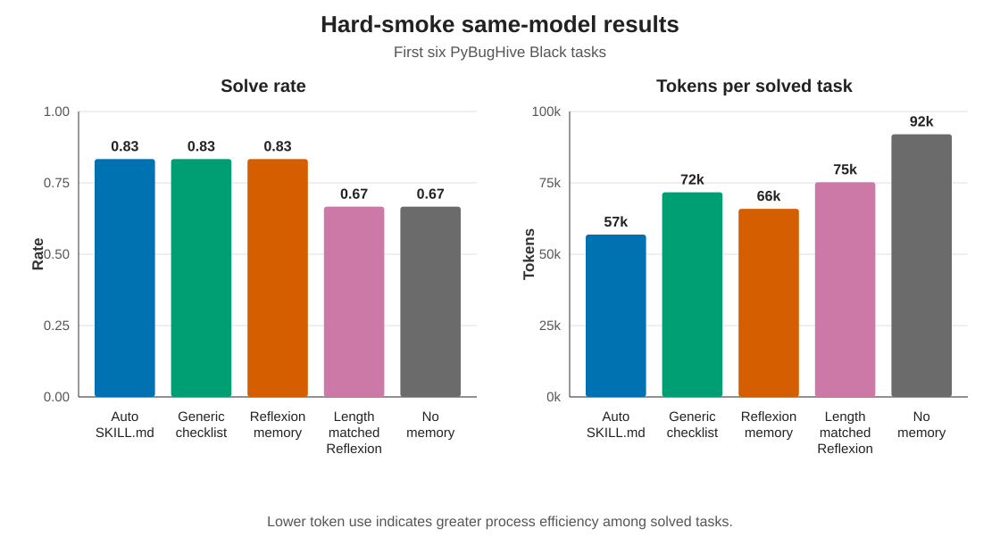
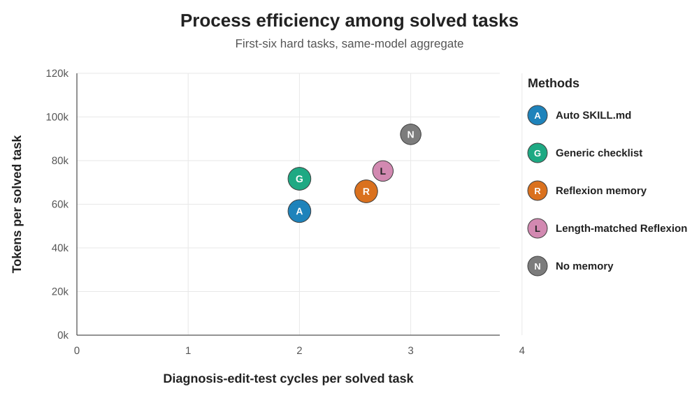
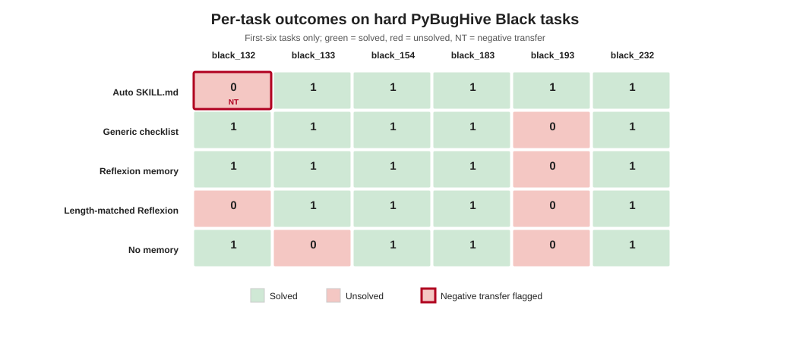

# Results

This section reports the hard-smoke evaluation on verified PyBugHive `black` debugging tasks. We treat the first six tasks as the primary quantitative result because they were run under the same model and harness configuration. The seventh verified task, `pybughive_black_234`, was completed later with `gpt-5.5` after the original `gpt-5.3-codex` configuration became unavailable, so it is reported only as exploratory supplementary evidence.

## RQ1: Does induced procedural memory improve low-shot debugging transfer?

Table 1 summarizes the same-model hard-smoke result over six held-out PyBugHive `black` tasks. Auto SKILL.md solved 5/6 tasks, matching the best solve rate achieved by the generic checklist and Reflexion-style memory. This is not evidence of solve-rate dominance: the strongest three methods are tied on solved tasks. The observed differences are instead in process measures. Among solved tasks, Auto SKILL.md used 56,867 mean tokens per solved task, compared with 65,915 for Reflexion memory, 71,694 for the generic checklist, 75,231 for length-matched Reflexion, and 92,031 for the no-memory baseline; uncertainty and sensitivity are reported below.

The comparison against the length-matched Reflexion control is useful but not decisive. Auto SKILL.md improves the observed solve count from 4/6 to 5/6 and reduces mean tokens per solved task by 24.4%. However, the solve-rate intervals are wide and the single execution per configuration leaves run-to-run variation unknown. The result is consistent with procedural organization helping beyond additional prompt text, but it does not isolate structure causally. A stricter structure-versus-content control below further narrows this interpretation.



Table 1 should be the main quantitative table in the paper.

```text
See: paper/tables/hard_first6_main_table.md
LaTeX: paper/tables/hard_first6_main_table.tex
```

## RQ2: Are the gains process-efficiency gains rather than only solve-rate gains?

The process metrics suggest that Auto SKILL.md can compress successful debugging behavior. Relative to Reflexion memory, Auto SKILL.md reduces diagnosis-edit-test cycles from 2.60 to 2.00 while also reducing mean tokens per solved task. Relative to no memory, it improves the observed solve count from 4/6 to 5/6 and reduces mean token cost by 38.2%. Relative to the generic checklist, it has the same solve rate and cycle average; its only aggregate advantage is 20.7% fewer mean tokens.

The paired common-solved analysis makes this more conservative by comparing Auto SKILL.md against each baseline only on tasks both methods solved. On the four tasks solved by both Auto SKILL.md and Reflexion memory, the paired mean differences (Auto minus baseline) are -1.00 cycles and -22,828 tokens; exploratory task-resampling 95% intervals are [-2.00, 0.25] and [-44,394, -1,262]. Against length-matched Reflexion, the corresponding differences are -1.00 cycles [-1.75, -0.25] and -27,258 tokens [-41,409, -13,106]. Against the generic checklist, however, the cycle difference is 0.00 [-0.75, 0.75] and the token difference is -11,816 [-30,266, 7,078]. Thus the current data distinguish Auto SKILL.md more clearly from reflection baselines than from a competent human-written checklist.

Wilson 95% intervals further show the coarse solve-rate resolution: 5/6 corresponds to [0.436, 0.970], while 4/6 corresponds to [0.300, 0.903]. These overlapping task-level intervals do not measure execution stochasticity. For token sensitivity, Auto SKILL.md has a solve-conditional median of 52,645 tokens, versus 55,994 for the checklist and 68,543 for Reflexion. Its leave-one-solved-task-out mean ranges from 47,974 to 62,676 tokens. The ranking is directionally robust in paired leave-one-task-out means, but the intervals remain wide at this scale.



```text
See: paper/tables/hard_first6_common_solved_pairwise.md
```

## RQ3: Does procedural memory avoid negative transfer?

No. Auto SKILL.md produced the only explicit negative-transfer flag in the same-model hard-smoke set. On `pybughive_black_132`, it failed and was annotated as performance negative transfer because the induced procedure directed attention toward a nearby but incorrect formatter invariant; the stored trajectory notes that the first attempted fix increased full-suite failures from four to six before later narrowing. This matters for the paper's framing: SKILL.md should not be presented as universally beneficial memory. A more defensible claim is that procedural memory can improve within-family transfer efficiency while still requiring explicit negative-transfer accounting.

The primary task-level matrix shows this subfamily sensitivity. Auto SKILL.md is the only method that solves task 193 and is the most efficient on task 232, but it fails on task 132. Reflexion memory and the generic checklist solve task 132 but fail on task 193. Different memory formats therefore transfer different prior regularities, motivating measurement of both successful and negative transfer.



```text
See: paper/tables/hard_first6_task_outcomes.md
```

## Supplementary structural-control rerun

After the main run, we added a same-model `gpt-5.5` comparison between Auto SKILL.md and a format-shuffled SKILL.md on the same six tasks. This rerun does not replace the main five-method table, which used `gpt-5.3-codex`. It tests whether procedural organization still separates behavior when skill content is preserved but the three-section organization is disrupted.

Both Auto SKILL.md and format-shuffled SKILL.md solved all six tasks under `gpt-5.5`. Auto SKILL.md used fewer recorded cycles per solved task (1.67 vs. 2.17) and fewer failed patches per run (0.50 vs. 0.83), but it was not more token-efficient in aggregate (111,978 vs. 102,006 tokens per solved task). Token medians are nearly identical (86,436 vs. 86,502). The mean difference is driven mainly by `pybughive_black_193`, where Auto SKILL.md used 258,676 tokens; excluding that task reverses the mean ordering (82,639 vs. 85,556). Token efficiency in this control is therefore outlier-sensitive rather than a stable method ranking.

```text
See: paper/tables/hard_first6_structural_control_gpt55.md
Detailed report: results/pybughive_hard_auto_vs_format_shuffled_first6_gpt55_report.md
```

This supplementary result weakens any claim that SKILL.md structure is necessary for solvability under a stronger model. The safer interpretation is that procedural organization changes process behavior, especially recorded cycles and patch churn, but the current evidence does not show uniform token-efficiency superiority over shuffled skill content.

## Qualitative case studies

Two tasks are particularly useful for the narrative in the primary five-method run. `pybughive_black_193` is the clearest positive transfer case for Auto SKILL.md in that table: it is the only method that solves the task, while both Reflexion baselines pursue a nearby but insufficient prior pattern. This makes it a good case study for why a structured trigger/procedure/failure-mode artifact can transfer better than unstructured reflection snippets in the original hard-smoke setting.

`pybughive_black_232` is a process-efficiency case in the primary run. All methods solve it, but Auto SKILL.md solves it in 1 cycle and 36,035 tokens, while Reflexion and length-matched Reflexion each require 3 cycles and more than 68,000 tokens. This is the cleanest example of the paper's core efficiency claim against the main memory baselines: even when solve rate does not separate methods, procedural memory can reduce the amount of diagnosis and patch iteration needed to converge.

`pybughive_black_132` should be discussed as the counterexample from the primary run. It prevents overclaiming and gives the negative-transfer metric a concrete role. The failure suggests that the induced SKILL.md can overfit a nearby procedural invariant when the held-out task belongs to an adjacent but different formatter subfamily. Because the later `gpt-5.5` rerun solves this task, the case should be framed as model- and run-specific negative transfer rather than as a stable property of the task.

## Exploratory all-seven result

The all-seven aggregate preserves the same broad pattern: Auto SKILL.md, Reflexion memory, and the generic checklist each solve 6/7 tasks, while length-matched Reflexion and no memory solve 5/7. Auto SKILL.md remains the most token-efficient successful method among the five primary methods overall. However, this table is model-mixed because `pybughive_black_234` was run with `gpt-5.5`, so it should be reported as supplementary evidence rather than as the main quantitative result.

```text
See: paper/tables/hard_first7_exploratory_table.md
Figure: paper/figures/hard_first7_exploratory_bars.svg
```

## Result takeaway

The main empirical takeaway is that induced natural-language SKILL.md is an inspectable procedural memory artifact whose transfer can be evaluated beyond solve rate. The current evidence does not show universal solve-rate superiority or a stable advantage over the generic checklist. It provides initial task-level evidence of lower process cost than reflection baselines, together with an explicit negative-transfer failure. The supplementary shuffled-control rerun further narrows the structural claim: organization appears to affect process behavior, but the current evidence does not prove that the canonical SKILL.md structure is necessary for solvability.
